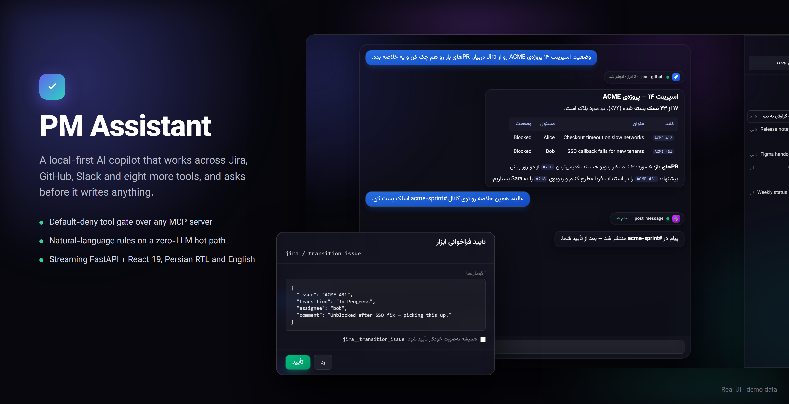
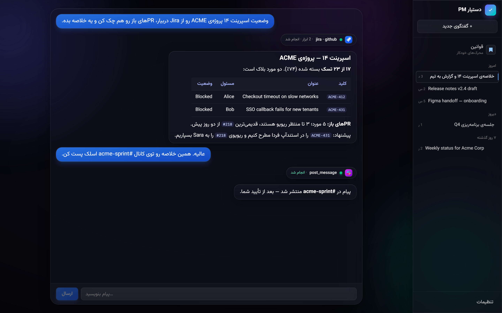
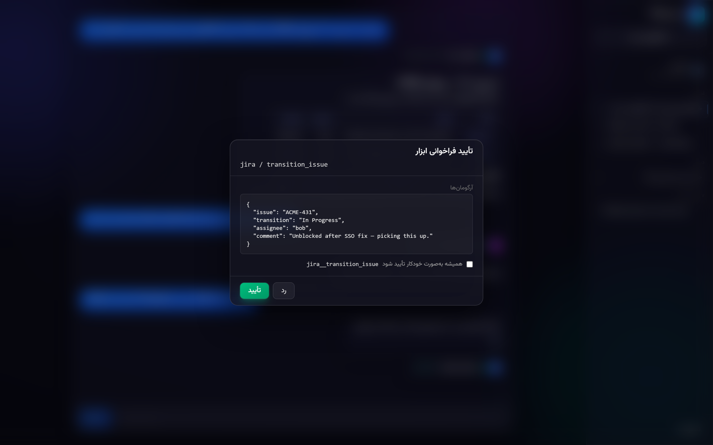
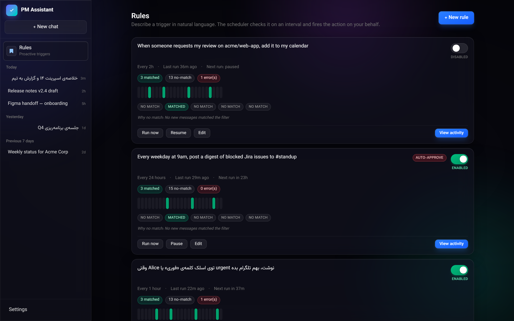
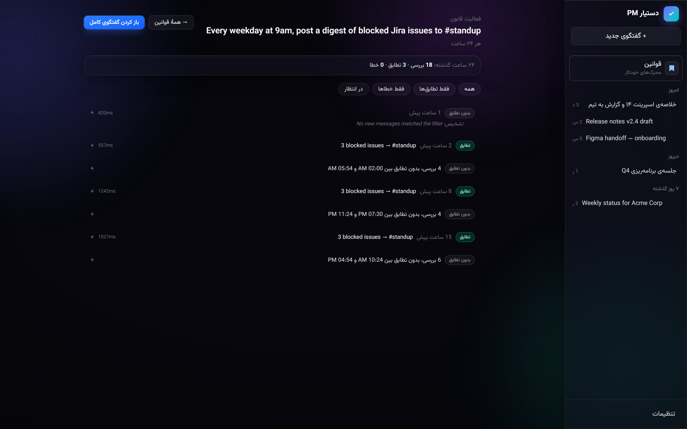
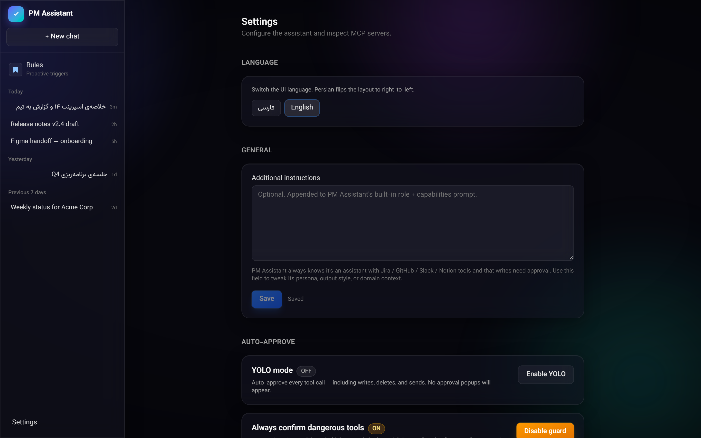
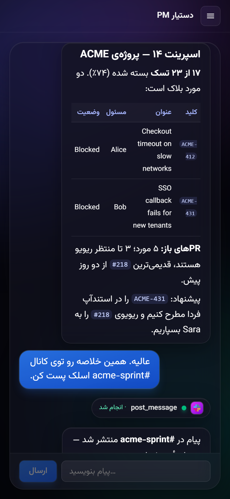
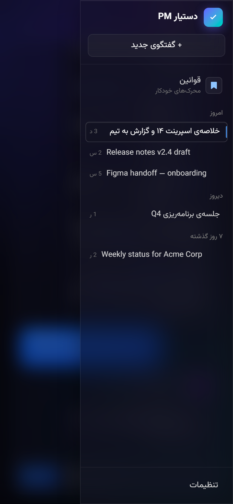

# PM Assistant



**A local-first AI copilot for project managers: it reads and acts across Jira, GitHub, Slack and eight more tools, and every write waits for your click.**


PM Assistant is an open-source desktop-style web app you run on your own machine. It streams responses from any model on [OpenRouter](https://openrouter.ai), routes tool calls through [Smithery Connect](https://smithery.ai) (a hosted MCP gateway that handles third-party OAuth), and persists everything to a local SQLite file. There is no multi-tenant cloud, no shared backend, no telemetry. The agent loop is reactive (chat-driven) **and** proactive (natural-language rules that poll on a schedule). A built-in Telegram bridge lets you talk to the same agent from your phone.

## Highlights

- **Approval-gated agent loop.** Reads run immediately; any write pauses the stream mid-turn and shows an approve/reject card (in the browser or on Telegram).
- **Default-deny tool policy.** Tools from arbitrary MCP servers are classified by verb tokens; anything unknown is treated as a write.
- **Rules that run while you sleep.** One LLM call compiles a plain-English trigger into a typed spec; the scheduler then polls with zero LLM calls until something matches.
- **Bilingual, RTL-first UI.** Persian (right-to-left) and English, glass UI on a dark aurora background, and a phone layout with a slide-in menu.
- **Tested.** 289 backend pytest tests (LLM and Smithery mocked) and 55 vitest frontend tests, both run in CI.

---

## Screenshots

All screenshots show the real UI running against a seeded SQLite file with invented data (Acme Corp, Alice, Bob). No LLM or Smithery call was made; the approval card is driven by a mocked SSE turn.

| | |
|---|---|
|  |  |
| **Chat (Persian, RTL).** Two read tools grouped into one card, then a markdown summary. *Demo data.* | **Approval gate.** A write tool (`jira__transition_issue`) paused mid-stream with its arguments. *Demo data.* |
|  |  |
| **Rules.** Natural-language triggers with poll history and match counts. *Demo data.* | **Rule activity.** Every poll, with no-match runs collapsed into one row. *Demo data.* |
|  |   |
| **Settings.** Language, extra instructions, YOLO mode and the dangerous-tool guard. | **Phone layout.** The sidebar becomes a slide-in menu. *Demo data.* |

---

## Why it's interesting

- **Default-deny tool gate.** Tools come from arbitrary MCP servers, so the agent cannot know which are safe. `backend/agent/policies.py` classifies tools by verb tokens and treats anything unrecognised, or with a write verb hidden after a read prefix, as a write that needs approval.
- **Approval-gated agent loop.** `backend/agent/loop.py` streams the model, reassembles tool-call fragments, and pauses the same in-memory session mid-turn until an approve/reject arrives over HTTP (or Telegram).
- **Natural language to typed rules.** `backend/services/rule_compiler.py` turns a sentence into a validated `CompiledSpec` with one LLM call in JSON mode, retrying once with the parser error fed back. After that the scheduler runs with zero LLM calls until a filter matches.
- **Hosted OAuth via MCP.** Third-party tokens never touch this backend; it talks JSON-RPC to Smithery Connect.
- **Tested.** Backend pytest suite (LLM and Smithery mocked), vitest frontend tests, and CI that runs both.

---

## Features

- **11 first-party integrations** out of the box — Jira, GitHub, Slack, Notion, Linear, Gmail, Google Calendar, Google Sheets, Outlook, Figma, Confluence. Add or remove servers by editing `backend/integrations.json`; any MCP server published on Smithery works.
- **Approval-gated tool calls** — every write is paused mid-stream and surfaced as a card you accept or reject. Reads auto-dispatch.
- **Default-deny tool gate** — verb-token classifier in `backend/agent/policies.py` (75 write tokens, 42 read tokens). New integrations inherit the policy with zero config.
- **YOLO mode** — opt-in toggle that auto-approves every tool call for the session. Off by default.
- **Proactive rules engine** — describe a trigger in plain English ("ping me on Slack when my GitHub PR gets a review request"). An OpenRouter call compiles it to a typed spec, APScheduler polls the source tool on an interval (≥ 60 s), matches stream into a pinned **Rules activity** chat. Hot path is LLM-free.
- **Telegram bridge** — long-poll client mirrors a private Telegram chat into the agent. Approve writes from your phone.
- **Glassmorphic UI** — animated aurora background, frosted panels, centered chat island, responsive down to phone width.
- **Streaming SSE everything** — token-by-token model output, tool-call lifecycle events, all over a single channel.
- **Tool grouping** — chained tool calls collapse into a single expandable group card so the timeline stays readable.
- **Smooth pending → success transitions** — the same card cross-fades from amber to emerald when a tool finishes, no flicker.
- **Local-first persistence** — async SQLite via SQLModel; chats, settings, rules, firings all live in `backend/data/pm.db`. Smithery owns third-party tokens.

---

## Architecture

```
┌──────────────────────────────────────────────────────────────────────┐
│                         Browser (localhost:5173)                     │
│  React 19 · Vite 8 · Tailwind v4 · Zustand · TanStack Query 5        │
│                                                                      │
│  ChatView ──── SSE ─────┐                                            │
│  ToolApproval ─ POST ──┐│                                            │
│  Integrations ─ POST ──┘│                                            │
└─────────────────────────┼────────────────────────────────────────────┘
                          │ /api  /sse   (Vite proxy)
┌─────────────────────────▼────────────────────────────────────────────┐
│                    FastAPI backend (localhost:8000)                  │
│                                                                      │
│  ┌──────────────┐    ┌────────────────┐    ┌─────────────────────┐   │
│  │ AgentSession │───▶│  MCPManager    │───▶│ Smithery Connect    │   │
│  │  (loop.py)   │    │  + builtins    │    │ (server-side OAuth) │   │
│  └──────┬───────┘    └────────────────┘    └─────────────────────┘   │
│         │                                                            │
│         ▼                                                            │
│  ┌──────────────┐    ┌────────────────┐    ┌─────────────────────┐   │
│  │  OpenRouter  │    │  APScheduler   │    │  Telegram bridge    │   │
│  │  (streaming) │    │  rule_engine   │    │  (long-poll)        │   │
│  └──────────────┘    └────────────────┘    └─────────────────────┘   │
│                                                                      │
│                     SQLModel  ──▶  data/pm.db                        │
└──────────────────────────────────────────────────────────────────────┘
```

The control plane lives in `agent/loop.py`: stream OpenRouter → assemble tool-call fragments → consult `agent/policies.py` → either dispatch immediately (read) or pause and emit `tool_call_request` (write). Approval comes back through `POST /api/chats/{chat_id}/approve`, which resumes the same in-memory `AgentSession`. Every Smithery call is plain JSON-RPC over `httpx`; backend never sees a Jira/Slack/Google token.

---

## Quick start

### Prerequisites

| Tool | Version |
|---|---|
| Python | 3.13 |
| [`uv`](https://github.com/astral-sh/uv) | 0.5+ |
| Node | 20+ |
| [`pnpm`](https://pnpm.io) | 9+ |
| OpenRouter API key | https://openrouter.ai/keys |
| Smithery API key | https://smithery.ai → Account → API Keys |

### Install

```bash
git clone https://github.com/<your-user>/pm-assistant.git
cd pm-assistant

cp .env.example .env
# edit .env, set OPENROUTER_API_KEY and SMITHERY_API_KEY

cd backend  && uv sync   && cd ..
cd frontend && pnpm install && cd ..
```

### Run (two terminals)

```bash
# Terminal 1 — backend on :8000
cd backend
uv run uvicorn main:app --reload --port 8000
```

```bash
# Terminal 2 — frontend on :5173 (proxies /api and /sse to :8000)
cd frontend
pnpm dev
```

Open <http://localhost:5173>. First boot creates `backend/data/pm.db` automatically.

### Demo mode (no API keys)

To browse the UI with invented data (no OpenRouter or Smithery account needed):

```bash
cd backend
DATABASE_URL=sqlite+aiosqlite:///./data/demo.db OPENROUTER_API_KEY=demo uv run python ../scripts/seed_demo.py
DATABASE_URL=sqlite+aiosqlite:///./data/demo.db OPENROUTER_API_KEY=demo uv run uvicorn main:app --port 8000
```

Chats, rules and rule activity render from the seed; sending a message needs a real key. `scripts/capture-screenshots.cjs` regenerates the images in `docs/images/` from a running demo instance (needs Playwright on `NODE_PATH`).

### Environment variables

| Variable | Required | Default | Notes |
|---|---|---|---|
| `OPENROUTER_API_KEY` | yes | — | Used for chat completions and rule compilation. |
| `SMITHERY_API_KEY` | for integrations | empty | Bearer token for `api.smithery.ai`. The app boots without it, but no tool can connect. |
| `OPENROUTER_DEFAULT_MODEL` | no | `google/gemini-3-flash-preview` | Override per-chat in Settings. |
| `SMITHERY_NAMESPACE` | no | `pm-assistant` | Logical namespace for connections. |
| `DATABASE_URL` | no | `sqlite+aiosqlite:///./data/pm.db` | Anything SQLModel-async-compatible. |
| `SMITHERY_API_BASE` | no | `https://api.smithery.ai` | For self-hosted Smithery. |
| `TELEGRAM_BOT_TOKEN` | no | — | Enables the Telegram bridge. |

`.env` lives at the **repo root**, not under `backend/`. `backend/config.py` loads `../.env` explicitly.

---

## Configuring integrations

Smithery Connect handles OAuth for every third-party service so this codebase never touches a Jira/Google/Slack token.

1. Open **Settings → Integrations**.
2. Click **Connect** on the row you want.
3. A popup opens to Smithery, which redirects to the upstream service for OAuth.
4. After you authorize, the popup closes; the row flips to **Connected** within ~2 s (frontend polls `POST /api/integrations/{name}/refresh`).
5. The agent's system prompt is rebuilt on the next message — its capability table now includes that integration's tools.

Click **Disconnect** to revoke. Smithery deletes the encrypted refresh token; tools disappear from the next agent turn.

<details>
<summary><strong>Adding a new integration</strong></summary>

Edit `backend/integrations.json`:

```json
{
  "linear": {
    "label": "Linear",
    "mcpUrl": "https://server.smithery.ai/linear/mcp"
  }
}
```

Restart the backend. The new row appears in **Settings → Integrations**. The MCP URL must be the canonical one shown on that server's Smithery page.

</details>

---

## Proactive rules

Rules let the agent *do work while you sleep*.

```
You: every weekday at 9am, summarize unread Slack DMs from my team and post the digest
     into #standup
```

The flow:

1. **Compile** — one OpenRouter call with `response_format=json_object` produces a typed `CompiledSpec` (source tool, filter, action prompt). Retries once on parse failure, then surfaces the error in the UI.
2. **Schedule** — `APScheduler` (`AsyncIOScheduler`, `max_instances=1`, default 5-minute interval) polls. The hot path is **zero LLM calls** when nothing matches — only the source tool runs.
3. **Match** — when the filter fires, an `AgentSession` runs against the pinned **Rules activity** chat, seeded with `[rule trigger] <action_prompt>. Context: <summary>`.
4. **Approve** — `auto_approve=True` rules run in YOLO mode; otherwise the same approval modal appears in the activity chat.
5. **Self-heal** — five consecutive failures auto-disables the rule and stamps `last_error` for inspection.

Create rules from `/rules` (manual two-step editor) or from chat (`rules__create_rule` builtin tool — the LLM is instructed to detect "whenever / every / if someone…" intents and ask you for interval + auto-approve before calling).

Supported filter kinds: `message_from_user_contains`, `new_issue_mentions`, `new_pr_review_request`, `schedule_only`. Adding a new kind is a five-step recipe: add the literal to `FilterKind` in `backend/services/rule_compiler.py`, add a required-field rule in `_validate_filter_invariants`, add a matcher in `rule_engine.py`, extend `_FILTER_GUIDE` so the LLM knows the kind, and add tests to `test_rule_compiler.py` and `test_rule_engine.py`.

---

## Telegram bridge

Set `TELEGRAM_BOT_TOKEN` in `.env`, restart, then enable the gateway under **Settings → Telegram gateway** and generate a pairing code. Send `/pair <code>` to the bot; that binds it to your chat, and messages from any other chat are ignored. A long-poll client subscribes to the bot's updates; messages from the paired chat are mirrored into a dedicated chat in the UI and run through the same agent loop. The bot replies on the same Telegram thread once the turn finishes — including any approval prompts (you tap a button on Telegram to approve).

This makes the assistant reachable from your phone without exposing the FastAPI server to the public internet.

---

## Settings

Open the gear icon. Everything here is persisted to `UserSetting` rows in SQLite.

| Setting | Effect |
|---|---|
| **Model** | Any OpenRouter model ID. Falls back to `OPENROUTER_DEFAULT_MODEL`. |
| **YOLO mode** | Auto-approve every tool call. Use sparingly. |
| **Auto-approve tools** | Per-tool allowlist for finer-grained YOLO. |
| **Show tool details** | Expand tool args/results inline by default. |
| **Additional instructions** | Free-form text appended to the system prompt under `## Additional instructions`. **Not** a system-prompt override. |

Mutating settings drops the in-memory `AgentSession` so the next message rebuilds the system prompt with new flags.

---

## Tech stack

| Layer | Tech |
|---|---|
| Frontend framework | React 19, Vite 8, TypeScript |
| Styling | Tailwind v4 (via `@tailwindcss/vite`, no config file); English and Persian UI strings in `src/i18n/` |
| Frontend state | Zustand (`src/store.ts`) + TanStack Query 5 |
| Backend framework | FastAPI, Python 3.13, async throughout |
| ORM / DB | SQLModel + `aiosqlite` |
| LLM client | `openai` SDK pointed at OpenRouter |
| MCP transport | `httpx.AsyncClient` against Smithery Connect (Streamable HTTP JSON-RPC) |
| Scheduler | APScheduler (`AsyncIOScheduler`) |
| Tests | `pytest` + `respx` (backend), `vitest` + `jsdom` (frontend) |
| Package managers | `uv` (Python), `pnpm` (Node) |

---

## Project structure

```
project-manager/
├── backend/              FastAPI app
│   ├── agent/            AgentSession loop, policies, system prompt assembly
│   ├── api/              HTTP routers: chats, settings, integrations, rules, sse
│   ├── db/               SQLModel models, async session, migration patches
│   ├── services/         rule_compiler, rule_engine, rule_scheduler, rule_tool
│   ├── integrations/     telegram/ (bot, pairing, bridge to the agent loop)
│   ├── integrations.json Declarative list of Smithery MCP servers
│   ├── smithery_client.py Thin httpx wrapper for Smithery Connect
│   ├── data/             SQLite file lives here (gitignored)
│   ├── tests/            pytest tests
│   └── main.py           FastAPI lifespan: scheduler, builtin tool register, telegram start
├── frontend/             Vite app
│   ├── src/
│   │   ├── components/   ChatView, MessageList, Composer, ToolApproval, RuleEditor, Sidebar
│   │   ├── lib/          stream.ts (SSE parser), api.ts
│   │   ├── store.ts      Zustand store — chats, approvals, settings
│   │   ├── tests/        vitest tests (more sit next to their components as *.test.tsx)
│   │   └── index.css     Tailwind v4 @theme tokens, glass utilities, aurora animation
├── docs/images/          Screenshots referenced from this README
├── scripts/              seed_demo.py (fictional demo DB), capture-screenshots.cjs
├── .env.example          Template — copy to .env and fill in keys
└── CHANGELOG.md          Release notes
```

---

## Tests

```bash
cd backend  && uv run pytest -v          # backend
cd frontend && pnpm test                  # frontend (vitest)

# single test
cd backend  && uv run pytest tests/test_agent_loop.py::test_turn_with_write_tool_requires_approval -v

# lint / typecheck
cd frontend && pnpm lint
cd frontend && pnpm build                 # tsc -b && vite build
```

`asyncio_mode = "auto"` is set in `pyproject.toml`, so `async def test_…` runs without the `@pytest.mark.asyncio` decorator. Smithery is fully mocked via `respx`; tests never hit the network.

---

## Security model

- **Default-deny tool gate.** `agent/policies.py` treats every tool as write-class unless its verb is on the read-token allowlist AND none of its segments are write tokens. Unknown tools are gated. The agent cannot bypass approval by inventing a tool name or burying a write verb after a read prefix.
- **Smithery error-body redaction.** `Bearer <token>`, `setupUrl=…`, and credential-shaped substrings are stripped from upstream error bodies before they land in `last_error`, `RuleFiring.error`, or any SSE `error` event.
- **No third-party tokens locally.** Jira / GitHub / Slack / Notion / Google / Outlook / Linear / Figma / Confluence credentials live encrypted at Smithery. Disconnecting from the UI revokes them upstream.
- **Single-user assumption.** There is no auth in front of the FastAPI server. Bind to `127.0.0.1` (the default) or put it behind a reverse proxy you control. Do not expose `:8000` to the internet.
- **Telegram callback authorization.** Every approve/reject callback validates `from.id == chat.id == bound_chat_id` before mutating the gate.
- **Rule auto-disable.** Five consecutive errors flip a rule to `enabled=False` so a misconfigured spec cannot quietly burn through your OpenRouter quota.

If you find a security issue, please email the maintainer rather than opening a public issue.

---

## Contributing

1. Open an issue describing the change. For non-trivial work, wait for a maintainer ack before coding.
2. Branch from `main`, name it `feat/...`, `fix/...`, `refactor/...`, etc.
3. Conventional Commits: `<type>(<scope>): <description>`.
4. Add tests. Backend changes need pytest coverage; frontend changes need vitest where it makes sense.
5. Run `pnpm lint`, `pnpm build`, `uv run pytest` before pushing.
6. Open a PR against `main`. Reference the issue.

See [`CHANGELOG.md`](CHANGELOG.md) for release history.

<details>
<summary><strong>House rules (read before your first PR)</strong></summary>

- Backend is `snake_case`, type-hinted on every signature, async throughout — no sync DB calls.
- Frontend is `camelCase`, Tailwind utility classes only — no CSS modules, no `tailwind.config.*`.
- Use `uv` and `pnpm`. Do not introduce `pip` or `npm`.
- Do not introduce Axios — `fetch` and `httpx` are the only HTTP clients.
- Do not hard-code solid panel backgrounds; use the `.glass-*` utilities from `src/index.css`.
- New SSE event type? Add handlers on **both** sides — the frontend silently drops unknown events.
- Settings mutations drop the agent session by design. Don't try to keep one alive across a `PATCH /api/settings`.

</details>

---

## License

MIT — see [`LICENSE`](LICENSE).

---

## Acknowledgements

- [Smithery](https://smithery.ai) for the hosted MCP gateway.
- [OpenRouter](https://openrouter.ai) for model routing.
- The MCP working group for the protocol that makes this small.

---

<sub>Built by <a href="https://sepehrradmard.ir">Sepehr Radmard</a> · <a href="https://www.linkedin.com/in/sepehr-radmard/">LinkedIn</a> · <a href="https://github.com/sepehr071">GitHub</a> · more projects on my <a href="https://github.com/sepehr071">profile</a></sub>
